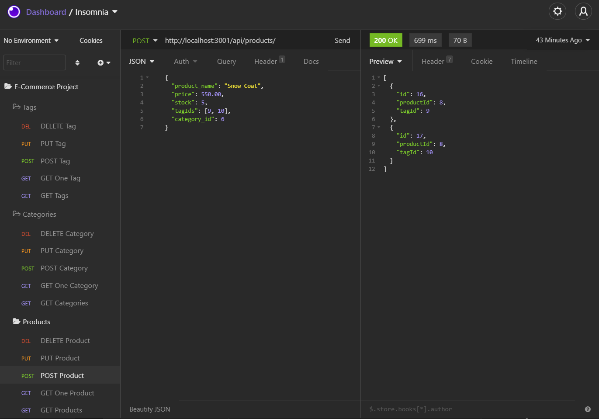

# E-Commerce (with express server and mysql)
## Description 
This is a server side application that returns data stored a mysql database through a series of api routes. 

Products, categories, and tags can be added, viewed, modified, and deleted.

## Table of Contents
- [Installation](#installation)
- [Usage](#usage)
- [Screenshot](#screenshot)
- [Screencast](#screencast)
- [Questions](#questions)

## Installation
Run "npm i" to install dependencies, including mysql2, express, sequelize, and dotenv. 

Update the .env file to connect to mysql. 

Run schema.sql to create the ecommerce_db. 

Run "npm run seed" to insert seed data into the ecommerce_db database. 

Start the server by typing "node server.js." 

## Usage
Run the express server by typing "node server.js" from the command line.

Use insomnia to access the route endpoints. 

From the http://localhost:3001/ local server several routes can be reached. 

### Routes 
GET /api/products, /api/products/:id, /api/categories, /api/categories/:id, /api/tags, /api/tags/:id

POST /api/products, /api/categories, /api/tags

PUT /api/products/:id, /api/categories/:id, /api/tags/:id

DELETE /api/products/:id, api/categories/:id, api/tags/:id

## Screenshot

## Screencast
[Part 1: Screencast Link](https://drive.google.com/file/d/1_wi40dQNB7osyLThQsqciKGvfCJdCIBP/view?usp=sharing)

[Part 2: Screencast Link](https://drive.google.com/file/d/1FcZ59Z4YmqIfaSiUn0hGKD6uTtODgWzu/view?usp=sharing)

## Questions

If you have questions about the repo, open an issue or contact me at 
cstuhlfire@gmail.com. 

You can find this project along with my other work 
at [Github](https://github.com/cstuhlfire).

